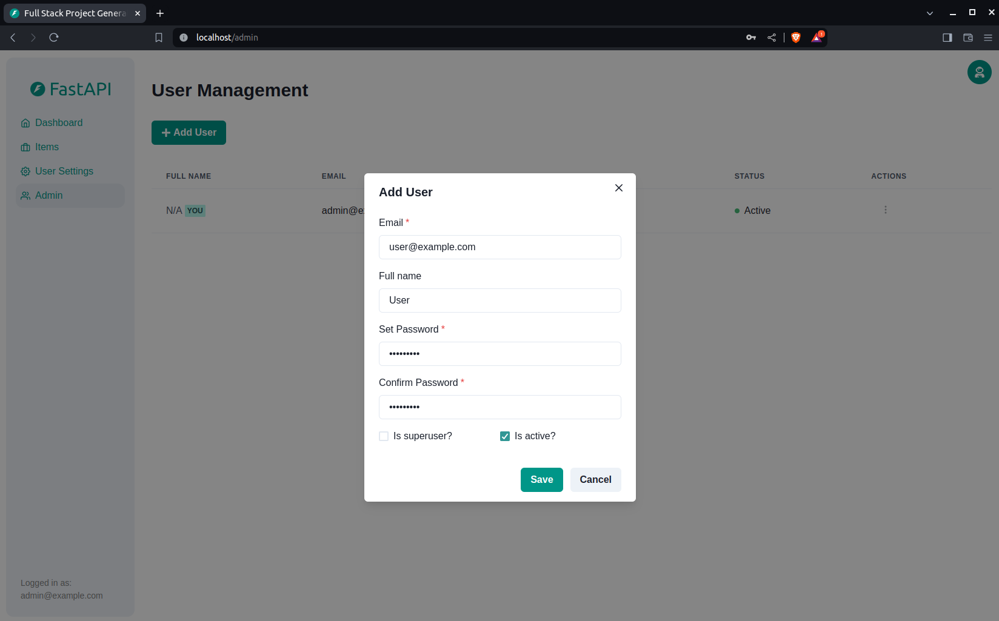

# AlOsaimi E-Learning

Arabic e-learning platform for **برنامج مهمات العلم** (Muhimmat al-Ilm) — Sheikh صالح بن عبدالله العصيمي’s foundational **15 متون** curriculum (aqidah, fiqh, hadith, usul, tafsir principles, Arabic grammar), with cohort sessions, lessons, and exams.

**Audience (student app):** most learners are **not** power users — older adults, parents, and mothers studying Sharia. Prefer **large visible controls** over keyboard-only or hidden gestures. Shortcuts may exist as a bonus; never as the only way to do something (e.g. audio ±seek must be on-screen on desktop and mobile).

- **Student app** (`frontend/student`, :5174) — Arabic RTL SPA for browsing program → phase → matn → lessons  
- **Admin app** (`frontend/admin`, :5173) — English LTR dashboard for content and users  
- **Backend** (`backend`, :8000) — FastAPI + PostgreSQL  

Product / curriculum notes for seed and UI copy: [backend/app/seed/README.md](./backend/app/seed/README.md) (15 متون → phases). Local agent conventions live in `AGENTS.md` / `.claude/skills/muhimmat-al-ilm/` when present on your machine.

Built on [`fastapi/full-stack-fastapi-template`](https://github.com/fastapi/full-stack-fastapi-template); some template docs below still describe the upstream sample app.

## Technology Stack and Features

- ⚡ [**FastAPI**](https://fastapi.tiangolo.com) for the Python backend API.
    - 🧰 [SQLModel](https://sqlmodel.tiangolo.com) for the Python SQL database interactions (ORM).
    - 🔍 [Pydantic](https://docs.pydantic.dev), used by FastAPI, for the data validation and settings management.
    - 💾 [PostgreSQL](https://www.postgresql.org) as the SQL database.
- 🚀 [React](https://react.dev) for the frontend.
    - 💃 Using TypeScript, hooks, Vite, and other parts of a modern frontend stack.
    - 🎨 [Chakra UI](https://chakra-ui.com) for the frontend components.
    - 🤖 An automatically generated frontend client.
    - 🧪 [Playwright](https://playwright.dev) for End-to-End testing.
    - 🦇 Dark mode support.
- 🐋 [Docker Compose](https://www.docker.com) for development and production.
- 🔒 Secure password hashing by default.
- 🔑 JWT (JSON Web Token) authentication.
- 📫 Email based password recovery.
- ✅ Tests with [Pytest](https://pytest.org).
- 📞 [Traefik](https://traefik.io) as a reverse proxy / load balancer.
- 🚢 Deployment instructions using Docker Compose, including how to set up a frontend Traefik proxy to handle automatic HTTPS certificates.
- 🏭 CI (continuous integration) and CD (continuous deployment) based on GitHub Actions.

### Dashboard Login

[](https://github.com/fastapi/full-stack-fastapi-template)

### Dashboard - Admin

[](https://github.com/fastapi/full-stack-fastapi-template)

### Dashboard - Create User

[](https://github.com/fastapi/full-stack-fastapi-template)

### Dashboard - Items

[](https://github.com/fastapi/full-stack-fastapi-template)

### Dashboard - User Settings

[](https://github.com/fastapi/full-stack-fastapi-template)

### Dashboard - Dark Mode

[](https://github.com/fastapi/full-stack-fastapi-template)

### Interactive API Documentation

[](https://github.com/fastapi/full-stack-fastapi-template)

## How To Use It

### Configure

The `.env` files are not tracked in Git. Create them from the provided templates before running the stack:

```bash
cp .env.example .env
cp frontend/admin/.env.example frontend/admin/.env
cp frontend/student/.env.example frontend/student/.env
```

You can update configs in the `.env` files to customize your configurations.

Before deploying it, make sure you change at least the values for:

- `SECRET_KEY`
- `FIRST_SUPERUSER_PASSWORD`
- `POSTGRES_PASSWORD`

You can (and should) pass these as environment variables from secrets.

Read the [deployment.md](./deployment.md) docs for more details.

### Generate Secret Keys

Some environment variables in the `.env` file have a default value of `changethis`.

You have to change them with a secret key, to generate secret keys you can run the following command:

```bash
python -c "import secrets; print(secrets.token_urlsafe(32))"
```

Copy the content and use that as password / secret key. And run that again to generate another secure key.

## Backend Development

Backend docs: [backend/README.md](./backend/README.md).

### Development seed (local عصيمي program fixtures)

Prestart only creates `FIRST_SUPERUSER` from `.env`. For demo users and multiple real programs (**مهمات العلم**, **أصول العلم**, **تمكين**, **أساس العلم**, **جمل العلم**, seasonal أحكام…), run:

```bash
cd backend && uv run python -m app.seed --clean --verbose
```

Curriculum map: [backend/app/seed/README.md](./backend/app/seed/README.md).

## Frontend Development

Frontend Admin docs: [frontend/admin/README.md](./frontend/admin/README.md).

## Deployment

Deployment docs: [deployment.md](./deployment.md).

## Development

General development docs: [development.md](./development.md).

This includes using Docker Compose, custom local domains, `.env` configurations, etc.

Student course player roadmap (beta baseline, deferred PDF work, feature catalog, best practices): [docs/student-learning-experience.md](./docs/student-learning-experience.md).

## License

The project is licensed under the terms of the MIT license.
